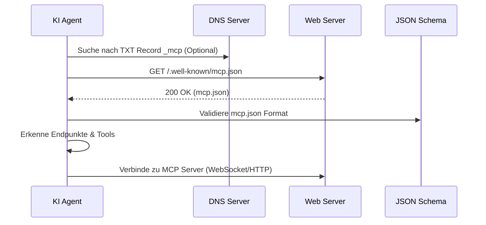

# well-known-mcp

<div align="center">
  
  
  
</div>


> Jede Domain braucht eine maschinenlesbare Visitenkarte für KI-Agenten.

So wie `robots.txt` den Suchmaschinen sagt, was sie crawlen dürfen, sagt `/.well-known/mcp.json` den KI-Agenten, was sie tun können. 

Die Agenten-Ökonomie erfordert ein standardisiertes Discovery-Verfahren. Agenten müssen herausfinden können, ob eine Domain Model Context Protocol (MCP) Endpunkte anbietet, welche Tools zur Verfügung stehen und wie die Authentifizierung abläuft. Dieses Repository ist die Referenzimplementierung für das Discovery-Verfahren über `/.well-known/mcp.json`.

## Warum Agent Discovery das neue SEO ist

Wenn in Zukunft ein erheblicher Teil der wirtschaftlichen Transaktionen durch autonome KI-Agenten gesteuert wird (Agent-to-Agent Commerce), entscheidet die Maschinenlesbarkeit eines Unternehmens über dessen Marktzugang. Wenn ein Agent einen Flug buchen, eine Steuererklärung einreichen oder ein Ersatzteil bestellen soll, sucht er zunächst nach standardisierten Schnittstellen.

`well-known-mcp` schließt die Lücke zwischen der reinen Webpräsenz und der agentischen Interaktionsfähigkeit.

## Architektur & Flow



## Vergleich: robots.txt vs. agent-card vs. mcp.json

| Standard | Zielgruppe | Zweck |
|----------|------------|-------|
| `robots.txt` | Suchmaschinen-Crawler | Zugriffssteuerung (Erlaubnis/Verbot zum Crawlen) |
| `agent-card.json` | Google A2A | Proprietäres Format für Agenten-Discovery |
| `mcp.json` | Universal (MCP) | Standardisierte Discovery von Tools & Ressourcen für alle Agenten |

## Pakete in diesem Repository

Dieses Monorepo enthält die offiziellen Referenz-Tools für die Implementierung und Validierung von `mcp.json`.

### 1. `@well-known-mcp/validator`

Validiert ein bestehendes `mcp.json` gegen das offizielle JSON Schema.

```bash
# Per CLI
npx @well-known-mcp/validator https://deine-domain.de

# Programmatisch
import { validateUrl } from '@well-known-mcp/validator';
const result = await validateUrl('https://deine-domain.de');
if (result.valid) {
  console.log("Valid MCP endpoint found!");
}
```

### 2. `@well-known-mcp/generator`

Ein interaktives CLI-Tool zur Erstellung standardkonformer `mcp.json` Dateien. Beinhaltet branchenspezifische Templates.

```bash
npx @well-known-mcp/generator init
```
*(Interaktiver Wizard für Steuerberater, Onlineshop, SaaS, etc.)*

### 3. `@well-known-mcp/middleware`

Express/Hono Middleware für Node.js Server.

```typescript
import express from 'express';
import { serveMcpDiscovery } from '@well-known-mcp/middleware';

const app = express();
app.use(serveMcpDiscovery({ configPath: './mcp.json' }));

app.listen(3000);
```

## Beispiele

Im Ordner `examples/` findest du Referenz-Implementierungen für reale Anwendungsfälle:
- [Steuerberater (DATEV, ELSTER)](examples/steuerberater.mcp.json)
- [Onlineshop (Produktsuche, Checkout)](examples/onlineshop.mcp.json)
- [Bank (Kontostand, KYC)](examples/bank.mcp.json)
- [Handwerker (Terminbuchung)](examples/handwerker.mcp.json)

## Spezifikation (Schema)

Die JSON Schema Definition befindet sich unter `spec/mcp-discovery.schema.json`. 
Aktuelle Version: `1.0`


## 🚀 Quantum Leap Architecture: JWS Cryptographic Proof

Wir gehen über ein simples JSON-Schema hinaus. Um MITM-Angriffe zu verhindern, muss `mcp.json` kryptographisch sicher sein.
- **JSON Web Signature (JWS):** Die Datei wird kryptographisch signiert und an das SSL/TLS-Zertifikat gekoppelt.
- **Zero-Trust Discovery:** Agenten verifizieren die Signatur lokal, bevor sie einen Tool-Call absetzen.
- **Dezentrales Fallback:** IPFS-CID Integration via DNS TXT für zensurresistente Kataloge.


---

**Teil des Agentic Commerce Stack von Matteo Ise:**

- [well-known-mcp](https://github.com/matteo-ise/well-known-mcp) — Discovery-Standard für KI-Agenten
- [agent-wallet-sdk](https://github.com/matteo-ise/agent-wallet-sdk) — Unified Payment Infrastructure für Agenten
- [agent-governance](https://github.com/matteo-ise/agent-governance) — Audit, Compliance & Human-Escalation
- [mcp-deutschland](https://github.com/matteo-ise/mcp-deutschland) — MCP-Server für ELSTER, DATEV, XRechnung
- [mcp-handelsregister](https://github.com/matteo-ise/mcp-handelsregister) — Deutsches Handelsregister für Agenten
- [agentic-commerce-sdk](https://github.com/matteo-ise/agentic-commerce-sdk) — Agent-to-Agent Commerce
- [agentic-maturity-model](https://github.com/matteo-ise/agentic-maturity-model) — Reifegrad-Framework (Stufe 0→5)
- [kontorstack](https://github.com/matteo-ise/kontorstack) — Full-Stack Framework für agentische Unternehmen

[Matteo Ise auf GitHub](https://github.com/matteo-ise) · [X/Twitter](https://x.com/matteoise)
